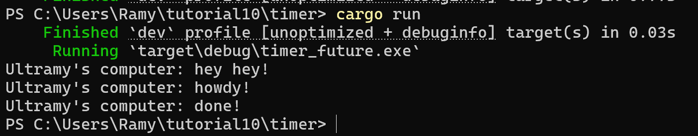
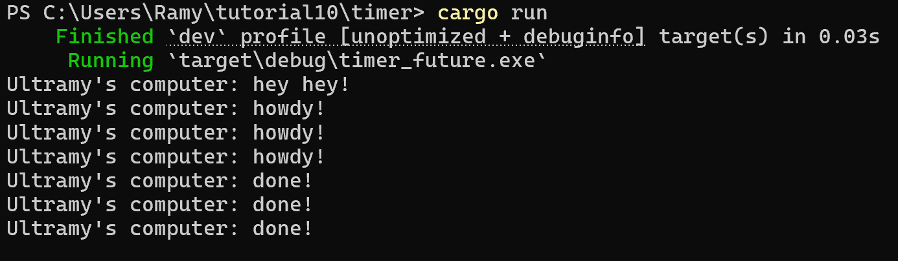

println!("hey hey!") dieksekusi dulu karena tidak async. Task async dijadwalkan namun tidak langsung dijalankan. Executor dijalankan setelah spawner di-drop. Task dimulai dan mencetak "howdy!". TimerFuture menunggu 2 detik. Lalu, tercetak 'done!'

Ini merupakan screenshot output. Terdapat 3x message. Hal ini dikarenakan terdapat 3 spawner. Program kita juga tidak berakhir - berakhir. Hal ini dikarenakan kita menghilangkan drop spawner. Ini menyebabkan program tidak mengetahui sinyal selesai.